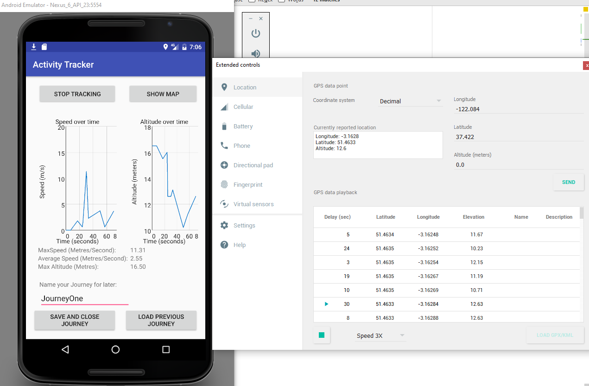

# Android Activity Tracker
This application was something I developed over two weeks’ worth of evenings 
during my time at the University of Nottingham and helped me to get a better grip of Android development.
Although not the most sophisticated app it makes use of quite a wide variety of android functionality including:

* Activities, 
* Broadcast receivers
* Content providers
* Services

## App purpose / Features
The app is designed to work as a basic GPS tracking app to allow a user to visualise a journey they are making in real time in 
addition to viewing analytics about their speed and altitude. The app makes use of the Google maps API to show the progress of 
the users journey and can store and reload past journeys from an SQL database, this allows the user to continue their journey
from where they left off should they chose to.

## Architecture
The app receives GPS data from the android GPS data service, this is then broadcast to the UI components that are listening
in order to update their displays. The SQL database is accessed by the activity UI components through an Android content provider
whenever the user requests a data point to be deleted or a journey loaded. GPS locations are also added to the database by the 
LocationManagementService which also can communicate with the location listener receiving the GPS coordinates.

